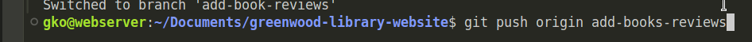

# greenwood-library-website

"greenwood-library-website" The website aims to be more engaging to its visitors. It currently incluses basic sections: Home, About_US, Events and Contact_US. Our team has decided to add Book_Reviews section and also update the Events secetion.

Additional description about the project and its features.

## Built With

- Major languages (HTML)

- Technologies used (Bash)

## Getting Started

To get a local copy up and running follow these simple example steps.

### Prerequisites

- A text editor(preferably Visual Studio Code)

### Install

- [Git](https://git-scm.com/downloads)
- [Node](https://nodejs.org/en/download/)

#### Clone this repository

```bash
For non-linux users, you can use:
git clone https://github.com/kelomo2502/greenwood-library-website.git

For Linux users, you can use:
git clone git@github.com:kelomo2502/greenwood-library-website.git
cd greenwood-library
```

### How to implement the project

- Create a repo on github and name it "greenwood-library-website"
  
- Initialize A README.md file
  
- Create home.html
  
- Create About_us.html
  
- Create Events.html
  
- Create Contact_us.html
- 
- Add random contents to each of the fles
  
- Add to staging area by using ```git add .``` command
  
- Commit the files using ``` git commit -m "my first commit message" ```
  
- Push the files to the remote repository using ```git push origin main``` command
  
- Create a branch for Morgan using the command ```git checkout-b add-book-reviews``` command. This command creates and switches to the created branch simultaneously
  
- Add a new file book_reciews.html using ```touch book_reviews.html``` command
  
- Add the book_reviews files to git staging are using ```git add book_reviews.html```
  
- Commit book_reviews_html to github history using ```git commit -m "Add book_reviews.html file"``` command
  
- Push from add_book_reviews to remote repo
  
- Raise a pull request from add_book_reviews branch to the main branch
  
- Merge the pull request to the main branch
- 
- Update the events.html file, however, pull the latest changes from the main branch by first checking out into main branch first using ```git checkout main``` and then run```git pull``` command
  
- Create the update-events branch and checkout into it using ```git checkout -b update-events```
  
- Add random contents to the events.html file
  
- Add the new update to git staging area using ```git add events.html```
  
  
- Commit the changes by running ```git commit -m "Add new events to events.html"```
  
- Push the commits to the update-events branch by running ```git push origin update-events```
  
- Create a pull request from the update-events branch to main branch and resolve all conflicts before merging
  

#### Run project

```bash
 open live-server in your vscode and click on Go Live
```

## Authors

👤 **Gbenga Oyewunmi**

- GitHub:(<https://github.com/kelomo2502/greenwood-library-website.git>)
- Twitter: @kelomojs

## 🤝 Contributing

Contributions, issues, and feature requests are welcome!

Feel free to check the [Github Issues](https://github.com/kelomo2502/greenwood-library-website/issues/3)

## Show your support

Give a ⭐️ if you like this project!

## 📝 License

This project is [MIT](https://opensource.org/licenses/MIT) licensed.
